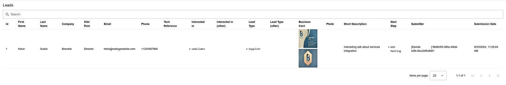
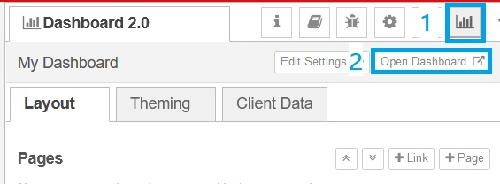

# Events Leads Capture

## ✨ What's this about

Focus on the value of your event by saving backoffice time and avoid forgetting precious information.

The **Leads Capture** semilimes recipe empowers your and your team's [semilimes](https://www.semilimes.com) experience to quickly set up a cheap and fully customizable solution for collecting, processing and storing your contacts' details during events/exhibitions, straight on your mobile phones.

Don't buy, install or train people on yet another dedicated software. All you need is in your hands. Get your free [semilimes app](https://www.semilimes.com) and start exploring this and other extension recipes!

## 🔎 What do you get

### Hosting options

You can choose to download this recipe and self-host it in any node-red environment. For a hassle-free approach, you can use the [semilimes Services](https://my.semilimes.net) to fully manage your recipe directly in a cloud-based environment. Choose the option that best fits for you.

### Adaptive data collection form

This recipe comes with a standard set of data requested to the people during events/exhibitions:

```
- First Name
- Last Name
- Company
- Site/Role
- Email
- Phone
- Technical Reference
- Interests list
- Lead type list
- Business Card pictures
- Other pictures
- Description
- Follow-up list
```

Specifically for the lists, you can change the preset options that the users will choose, according to your business type and network.

### Real-time record processing

On each interaction on the proposed data collection form, the data will be instantaneously processed and saved in the internal storage, to ensure you don't lose any precious information.

### Unlimited form sharing 

Anyone within your sales and technical teams (and more!) can join in using this workflow. The published form can be shared with all the team members to parallelize the collection process from each team member's phone.

### Review organized information

By using the integrated dashboard, anyone responsible for the data review and registration can quickly access all the collected data, review them, save the raw data and perform further processing in the company systems.

### Free solution

You can use it as it is, tweak or extend it as much as you like. Everything is under your control!

## 📽️ How does it work

Once the solution is run under your subaccount, the following happens...

### Leads Form Channel Creation

A new `Leads Form` channel will be automatically created. This form will be populated with the actual data collection form that you have configured in this recipe.


This is the channel that you can share with your team, so that everyone will be able to use the form and collect data.

### Leads Results Channel Creation

The `Leads Results` channel will be created to collect all the collected information directly in-app. This channel should NOT be shared as it is meant to be a service container and to be used for a quick review of the submitted info by the other users.


### Dashboard Creation

A Node-RED dashboard page will be created in your environment, and this is meant to be the place where to review the collected data.

Depending on your hosting choice, this page is directly reachable from your node-red instance in the cloud or on your on-premise system.

In the configuration section you will find out how to setup semilimes to access it directly from your mobile/web app.



## 👁‍🗨 Try it out!

We have already implemented a demo version to let you have a first look about how the process works.

In this case, you will be a team member accessing a leads form to fill during an event.

> Scan the QR Code below with your semilimes app to get direct access to the demo.

| QR Code |
| --- |
|  |


Don't forget to explore *all demos* we have prepared for you!

| QR Code |
| --- |
|  |


## ⚙️ Configuration instructions

### Cloud-based solution

**Step 1: Create a NodeRED Instance**

- Access the [semilimes Services](https://my.semilimes.net)
- Select any of your subaccounts
- Setup API payment methods
- Enter the NodeRED section
- Select the instance type
- Select the NodeRED stack (**Note:** this recipe is tested with NodeRED 3.1.9)
- Open your freshly created NodeRED editor in the cloud

**Step 2: Verify Environment Variables**

You should check you have the following environment variables already set-up for you for this recipe to work.


**Step 3: Download necessary NodeRED packages**

In your NodeRED editor, select "Manage Palette" in the menu, and install the following packages:

- `@semilimes/node-red-semilimes`
- `@flowfuse/node-red-dashboard`

**Step 4: Import the recipe**

- Download the [Leads Capture Flow](https://github.com/semilimes/leads-collection/blob/main/node-red/leads_capture_flow.json) file
- Create a new flow in your NodeRED editor
- Choose Import from the menu, and select the file you downloaded
- In the right panel, select the wheel icon to select the connector nodes. Double click on "SMECON" semilimes connector and verify that the API KEY selected is set to `SME_API_KEY` or whatever you configured in Step 3 as an environment variable. If the field is empty, make sure you fill it before proceeding.


- Click Deploy

You should now have your recipe ready for startup!

**Step 5: Activate the recipe**

In your new flow, trigger the `Setup Channels and Form` button to publish all the elements in your semilimes subaccount


**Step 6: Verify channels on your semilimes app**

Access your semilimes app, select your subaccount and verify that the required channels have been created

**Step 7: Verify Dashboard**

In your NodeRED editor, select the dashboard on the right side panel (expand it if you don't see the dashboard icon), and then select `Open Dashboard`. You should find your empty data table here, ready for displaying new collected information.




## 💡Extension ideas 

...

## 🛠️ Troubleshooting 

...

## Changelog

### v1.0.0

Initial Release
